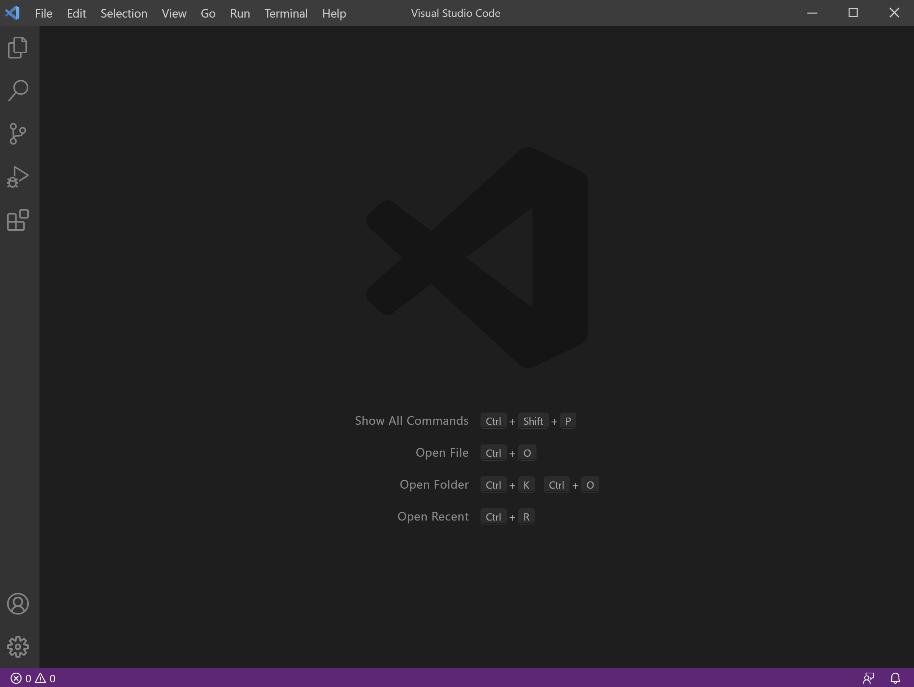
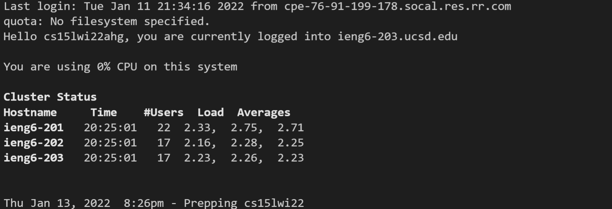
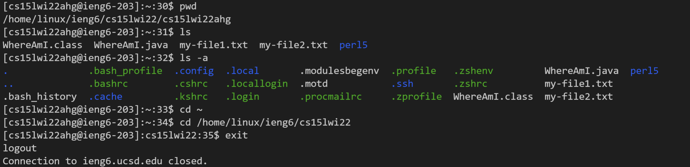
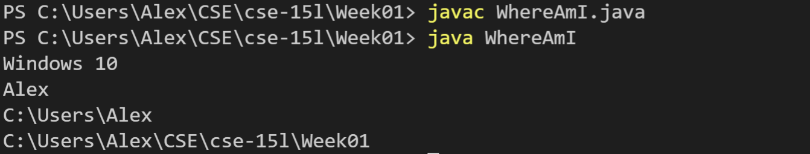
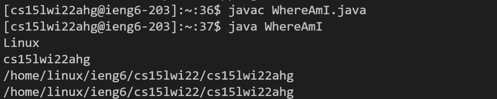
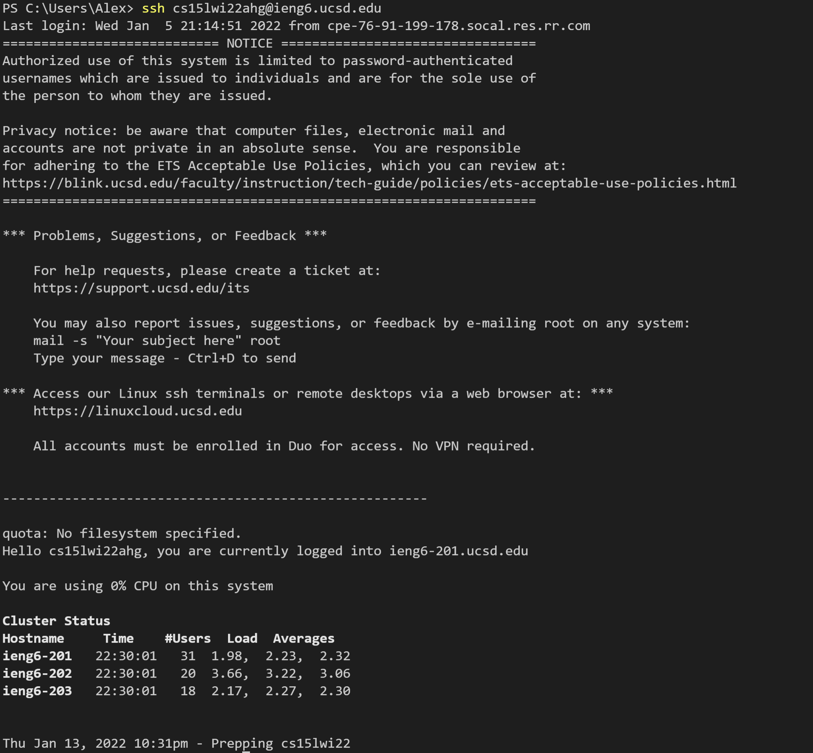
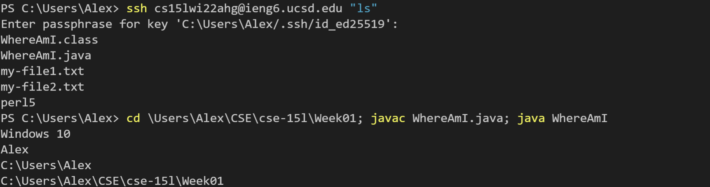

# **Remote Access**
by Alex Tahan

---

In this tutorial, you will learn how to log into a course-specific account on `ieng6`.

---

## 1. Installing VSCode
First, you will need to download Visual Studio Code, which is a code editor. VScode can be downloaded [here](https://code.visualstudio.com/). Make sure to download the right version for your computer.

After installation is complete, open up Visual Studio Code. You should get a window that looks like this: 

> 
> Initial VScode startup.

---


## 2. Remotely Connecting
We can use VScode to remotely connect to another computer over the Internet, and do work on it.

First, for Windows users, make sure you have the program **[OpenSSH](https://docs.microsoft.com/en-us/windows-server/administration/openssh/openssh_install_firstuse)** downloaded.

Then, find your course-specific account [here.](https://sdacs.ucsd.edu/~icc/index.php)

Open the Terminal in VScode (Terminal -> New Terminal) and type the following command: (fill in the blank with your course-specific account name) 
```
$ ssh cs15lwi22___@ieng6.ucsd.edu
```
You'll get a message about the authenticity of host can't be established, type `yes`. Once you enter your password, you will see a screen like this: 
>  
> There will be information about the server and which host you are currently connected to.

Now your terminal is connected to a remote computer! Your computer is considered the *client* and the remote computer is called the *server*.
***

## 3. Trying Some Commands
You can get used to the server by typing some commands.
- `pwd`
- `ls`
- `ls -a`
- `ls -lat`
- `cd`
- `cd ~`

To log out of the server, use *Ctrl-D* or `exit`.

>  
> Test out some commands on the server.

---

## 4. Moving Files with `scp`
One important part of working on a remote server is the ability to copy files from your computer to the server. From the *client* terminal (not logged in to the server), use the command `scp` to copy files to the server. 

To test this out, create a file `WhereAmI.java` with the following content: 
```
class WhereAmI {
  public static void main(String[] args) {
    System.out.println(System.getProperty("os.name"));
    System.out.println(System.getProperty("user.name"));
    System.out.println(System.getProperty("user.home"));
    System.out.println(System.getProperty("user.dir"));
  }
}
```

Run it using `javac` and `java` on your computer.
Then, in the terminal from the directory where the file is located, run the command (using your username):
```
$ scp WhereAmI.java cs15lwi22zz@ieng6.ucsd.edu:~/
```

Afterwards, log back into `ieng6` and use `ls`. You should be able to see `WhereAmI.java` in the home directory (you can see it when I ran `ls` above).
Now, run `WhereAmI.java` on the *server* using `javac` and `java`. You should see a different output from when you ran it on your computer!

> Client: 
> 
> Server:
> 

---

## 5. Setting an SSH Key
As you might have noticed by now, the process of logging in to the server every time you run `ssh` or `scp` can be quite tedious and time consuming. 

There is a solution: `ssh` keys. A *public key* will be stored on the server, and a *private key* will be stored in a secure location on your client. These files will act in place of a password, allowing you to log in more easily. 

There are a couple commands that you should run on the client computer: 
```
$ ssh-keygen
Generating public/private rsa key pair.
Enter file in which to save the key (/Users/<username>/.ssh/id_rsa): /Users/<username>/.ssh/id_rsa
Enter passphrase (empty for no passphrase): 
Enter same passphrase again: 
Your identification has been saved in /Users/<username>/.ssh/id_rsa.
Your public key has been saved in /Users/<username>/.ssh/id_rsa.pub.
The key fingerprint is:
SHA256:jZaZH6fI8E2I1D35hnvGeBePQ4ELOf2Ge+G0XknoXp0 username@server@LOCAL-HOSTNAME
The key's randomart image is:
+---[RSA 3072]----+
|                 |
|       . . + .   |
|      . . B o .  |
|     . . B * +.. |
|      o S = *.B. |
|       = = O.*.*+|
|        + * *.BE+|
|           +.+.o |
|             ..  |
+----[SHA256]-----+
```

For Windows users, follow [these steps](https://docs.microsoft.com/en-us/windows-server/administration/openssh/openssh_keymanagement#user-key-generation) instead.

Next, you need to copy the *public* key to the server.
```
$ ssh cs15lwi22zz@ieng6.ucsd.edu
<Enter Password>
# now on server
$ mkdir .ssh
$ <logout>
# back on client
$ scp <public key location> cs15lwi22zz@ieng6.ucsd.edu:~/.ssh/authorized_keys
```
> 
> Logging in to the server no longer requires a password after adding the `ssh` key.

---

## 6. Optimizing Remote Running
There are some shortcuts for running commands.
- Writing a command in quotes after an `ssh` command will run it directly on the server and then exit. 
- You can use semicolons to write multiple commands on the same line.
- The up arrow key will recall the last command that was run.
> 
> Using some of the shortcuts saves time.

---
