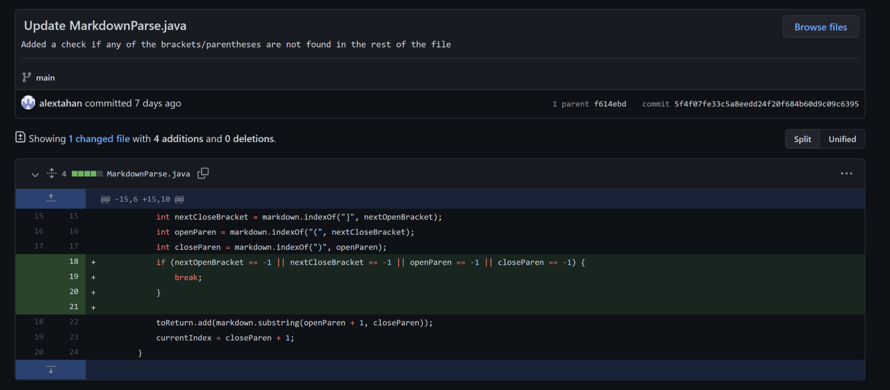
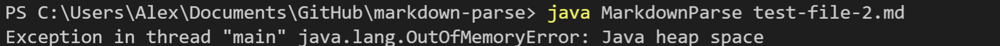
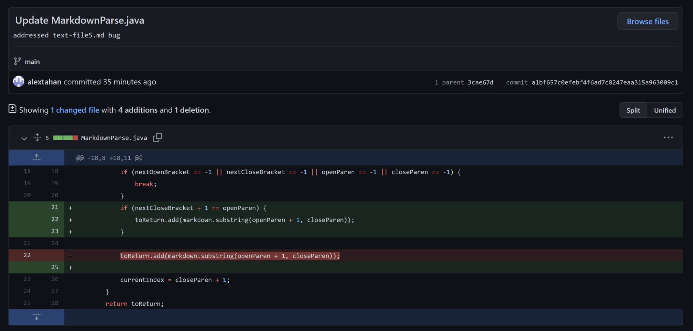
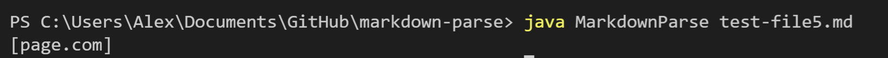
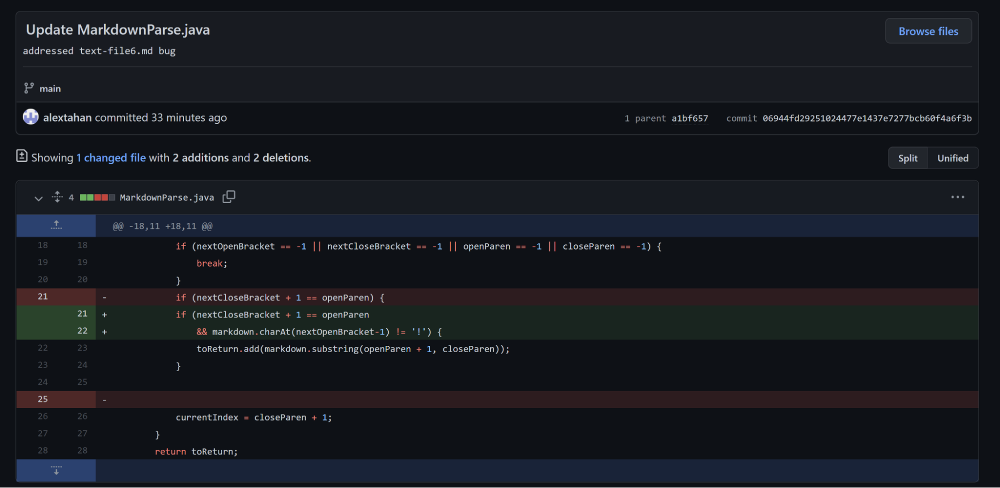
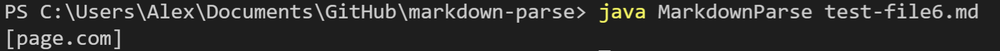

# **Fixing Bugs**
by Alex Tahan

---

## Bug 1:

> 
> Code change for the first bug.

> 
> Symptom of the failure-inducing input. 

The failure-inducing input was [test-file-2,](https://github.com/alextahan/markdown-parse/blob/main/test-file-2.md?plain=1) where there was some text after the last link. The bug in the code was that it would never stop looking for links if the last character in the file was not a close parentheses. This produced a symptom where the program would keep running, until there was an OutOfMemoryError. 

---

## Bug 2:

> 
> Code change for the second bug.

This bug occurred by failing to check if the markdown format for links was correct. With a failure-inducing input like [test-file5,](https://github.com/alextahan/markdown-parse/blob/main/test-file-2.md?plain=1), where the close bracket and the open parentheses were not consecutive, the program would produce a symptom where it would still consider the text in the brackets as a link. 

> 
> Symptom of the failure-inducing input. *page.com* is not a link and just in brackets, so it should not be listed.

---

## Bug 3:
> 
> Code change for the third bug.

With a failure-inducing input like [test-file-6,](https://github.com/alextahan/markdown-parse/blob/main/test-file-2.md?plain=1) the program would show symptoms where the sources of images are considered links when they should not be. The bug is failing to check for the "!" before the open bracket, which is indicative of an image.

> 
> Symptom of the failure-inducing input. The source of the image was considered a link.
