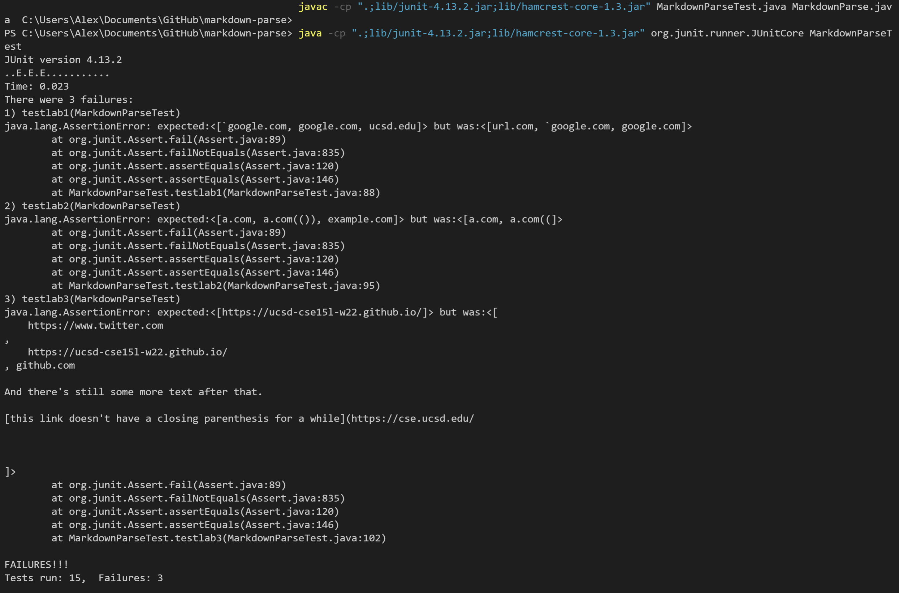
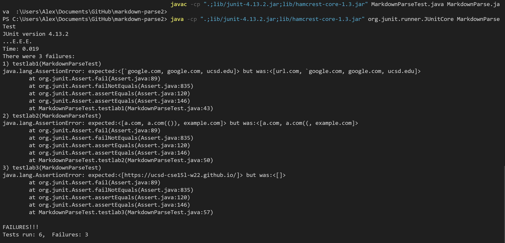

# **Code Snippets**
by Alex Tahan

---

My markdown-parse implementation: [https://github.com/alextahan/markdown-parse](https://github.com/alextahan/markdown-parse)

The markdown-parse implementation I reviewed: [https://github.com/AchuthKrishna/markdown-parse](https://github.com/AchuthKrishna/markdown-parse)

---

Using the VScode preview, [Snippet 1](https://github.com/alextahan/markdown-parse/blob/main/test-lab-1.md) should have the links
```
[ "`google.com" , "google.com" , "ucsd.edu" ]
```

[Snippet 2](https://github.com/alextahan/markdown-parse/blob/main/test-lab-2.md) should have the links 
```
[ "a.com" , "a.com(())" , "example.com" ]
```

And [Snippet 3](https://github.com/alextahan/markdown-parse/blob/main/test-lab-3.md) should have the links
```
[ "https://ucsd-cse15l-w22.github.io/" ]
```

All three snippets were pasted in separate markdown files, and tests for each file were added like the example below:
```
@Test
public void testlab1() throws IOException{
    String file = Files.readString(Path.of("test-lab-1.md"));
    List<String> expect = List.of("`google.com", "google.com", "ucsd.edu");
    assertEquals(expect, MarkdownParse.getLinks(file));
}
```

---

## My Code

> 
> Running the tests on my markdown-parse implementation.

All three tests failed with my MarkdownParse code. For the first code snippet (labeled `testlab1` in the output), the actual output included an additional link `url.com` and did not include `ucsd.edu`. 

This seems to deal with how brackets, backticks, and parentheses are prioritized in Markdown. There could be a simple fix for this, which is to find the start and end of the backtick texts, and use the index of the last backtick to search for the next close bracket, essentially ignoring brackets inside backticks. For parentheses, this rule would not apply when searching for the close parentheses.

---

For the second code snippet (labeled `testlab2` in the output), the actual output differed from the expected output by not including the full link `a.com(())`, and not including `example.com`.

In order to pass this test, a larger code change would probably be needed. A method similar to the findCloseParen method in the week 8 lab, which looks for the last parentheses in a group of embedded parentheses. Another method like this would also be needed for the embedded brackets.

---

For the third code snippet (labeled `testlab3` in the output), the actual output included a large amount of text from the file, instead of `https://ucsd-cse15l-w22.github.io/`.

In order to account for new lines, this would likely be a small change of searching for `\n\n` (a line break) within the brackets or parentheses. This would be similar to how the code checks for a space or period in the link.

---

## The Other Code

> 
> Running the tests on the other implementation.

All three tests also failed with this implementation of the MarkdownParse code. For the first code snippet (labeled `testlab1` in the output), the actual output included an additional link `url.com`. 

For the second code snippet (labeled `testlab2` in the output), the actual output differed from the expected output by not including the full link `a.com(())`.

For the third code snippet (labeled `testlab3` in the output), the actual output did not have any links, instead of the expected `https://ucsd-cse15l-w22.github.io/`.