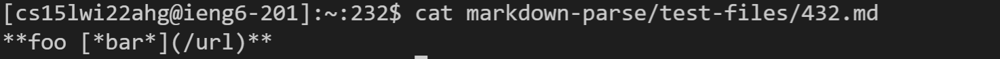
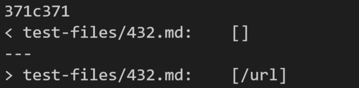
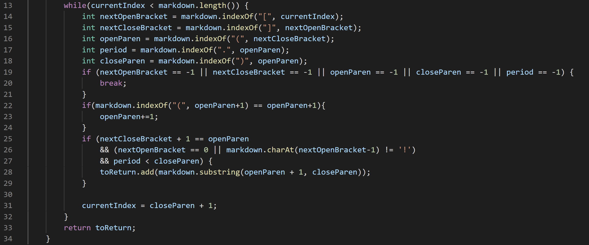
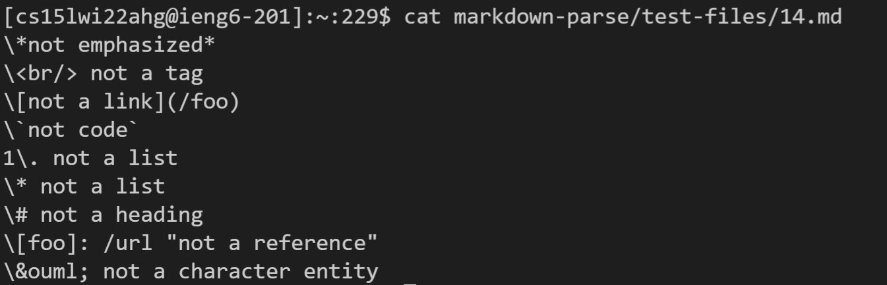
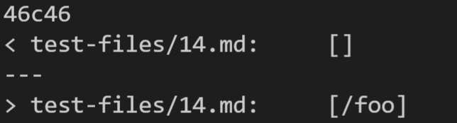
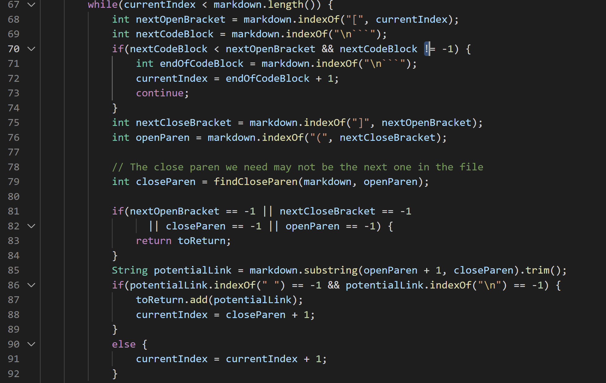

# **CommonMark Tests**
by Alex Tahan

---

I found the tests that had different results using `diff` on the results of running the bash for-loop in `script.sh`.

## Test 1:

> 
> The contents of the test file, which was `test-files/432.md`

In this file, the expected output is `[/url]`, and the bold/italic formatting is not factored in to determining if there is a link.

The actual outputs for both implementations were: 
> 
> Actual outputs of both implementations. The top is my implementation and the bottom is the other implementation.

The other implentation had the correct output, and mine was incorrect. In order to try to solve test cases where the text inside the parentheses was not a link, I added a check for if the link text contained a period, since most links contain periods.

The bug is that there are some links that do not require a period, for example when referring to a pathway in a repository (which is what I do in this writeup for the images). These would be left out in my implentation. 

The check for a period in lines 19 and 27 would need to be removed, and there would need to be a different way to check if the text is actually a link.

> 
> The code for my MarkdownParse implementation.

---

## Test 2:

> 
> The contents of the test file, which was `test-files/14.md`.

In this file, the expected output is an empty ArrayList `[]`, since there are no links. 

The actual outputs for both implementations were: 
> 
> Actual outputs of both implementations. The top is my implementation and the bottom is the other implementation.

My implementation had the correct output, and the other was incorrect. (However, I think my implementation was just lucky in being correct, because the same bug as Test 1 would apply here too.) 

The bug in the other implentation is that the code does not check for a backslash before the brackets (or parentheses), which in markdown would cause the special character to be ignored and just displayed as regular text. 

This could be fixed by adding a check for backslash before each bracket or parentheses, around line 84, and continuing to the next loop iteration if one is found. 

> 
> The code for the MarkdownParse implementation.
